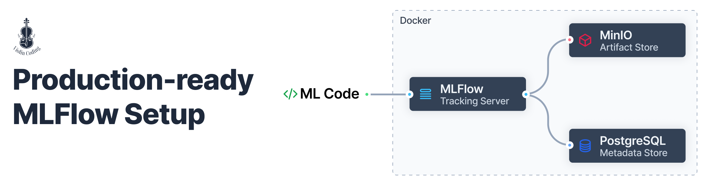

# mlflow-setup

This repository contains the code for setting up MLFlow Tracking Server with PostgreSQL as backend and [RustFS](https://github.com/rustfs/rustfs) (an S3-compatible object store) as artifact store, using docker-compose.

## Prerequisites

Docker and docker-compose should be installed on your machine, either through [Docker Desktop](https://www.docker.com/products/docker-desktop/), or its alternatives such as [Orbstack](https://orbstack.dev/)

## Configure environment variables

Make a copy of the `docker/.env.example` file and rename it to `docker/.env`. Then, update the environment variables in the `.env` file as per your requirements.

## Build and start the services

```bash
docker compose up -d --build
```

If everything is setup properly, you should be able to access the services at the following URLs:

- MLFlow Tracking Server: [http://localhost:5001](http://localhost:5001)
- RustFS Console UI: [http://localhost:9001/rustfs/console/](http://localhost:9001/rustfs/console/) (log in with `RUSTFS_ACCESS_KEY` / `RUSTFS_SECRET_KEY`)

## Migrating from MinIO

Earlier versions of this repo used MinIO, which is no longer maintained. Artifacts stored in the old `minio_data` volume are not migrated automatically. To keep them, start the old MinIO container alongside RustFS and copy the `mlflow` bucket across with any S3 client (e.g. `rclone sync` or `aws s3 sync`).
